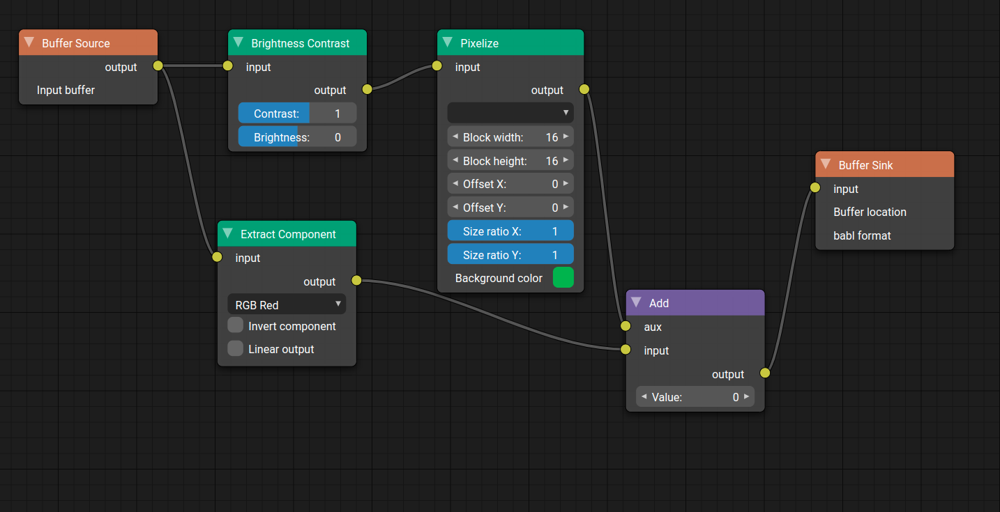

# Pixel Flow UI

Typescript implementation of a node graph editor mainly inspired by Blender Nodes.

The editor is generic enough to be used in different contexts, as an example the editor is used as an
graphical frontend to create [GEGL](https://www.gegl.org/) node graphs.

# Screenshot

# TODO

* handle node resize (IdleState)

# BUGS

* Key pad "."/SUPPR, CTRL-A and Escape not working
* Some CTRL-Z and CTRL-Y are lost after select opened => focus still on inputs ?
* Adjust zoom panning (zoom not properly centered on mouse)